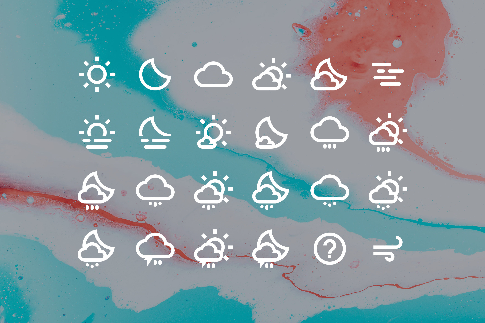
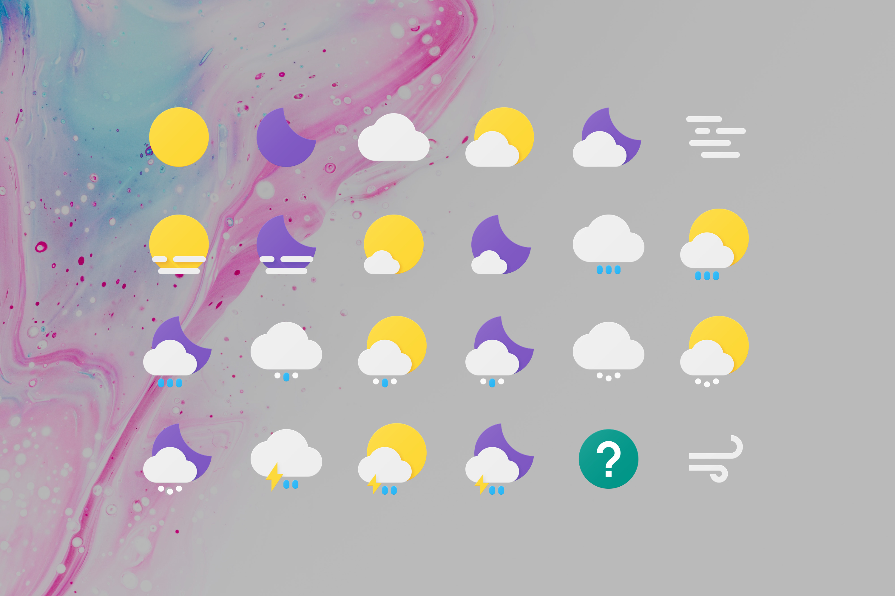
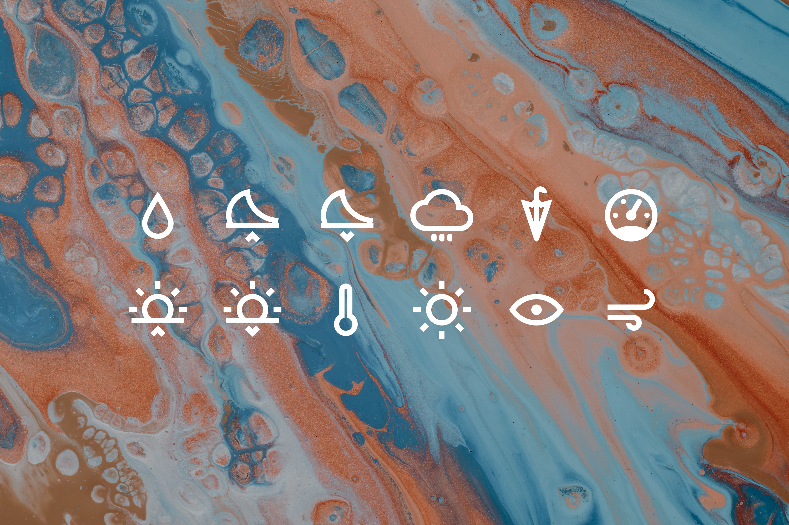
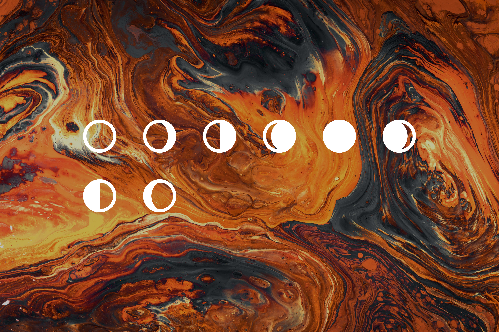
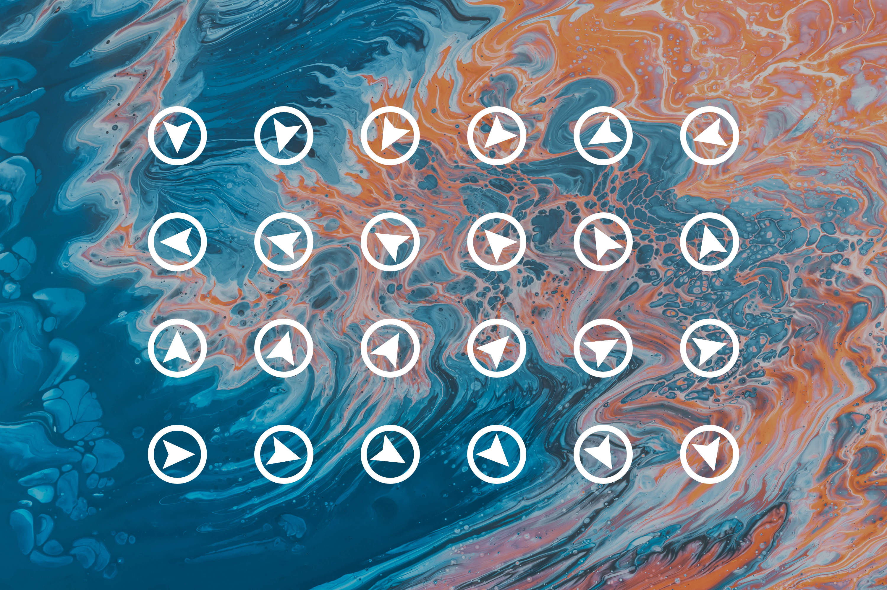

# JDWI

JDWI stands for Jelle Dekkers' Weather Icons.
While creating Rainmeter skins, I was struggling to find good looking, consistent weather icons that fit well with Google's Material Design language. There are the icons made by Erik Flowers, which do look good, but aren't really 'material'. Then there are these ones, but they're not quite it for me.
So, I decided to make my own. Over the years, these have changed a lot, but this is what they are today. The icons haven't really changed at all since late 2020.
They were created using Adobe Illustrator CC in a 24×24 px grid for the monochrome icons, and 192×192 px grid for the colored ones. All of the .ai Illustrator files and SVGs are included in the .zip package.
For all of the variants (excluding JDWI-COLR), an icon font is included as well. Those were created using IcoMoon, for which the project file is included too. The fonts support ligatures, which means you can simply set the text to the name of the icon, and it will work. The name of the icon is identical to the name of the svg file (and artboard in the .ai files), but without the extension of course.
I am not a web developer, so I have no idea how to use these icons on the web. These were mainly created for use in Rainmeter.

## JDWI

## JDWI-COLR

## JDWI-MISC

## JDWI-MOON

## JDWI-WIND

